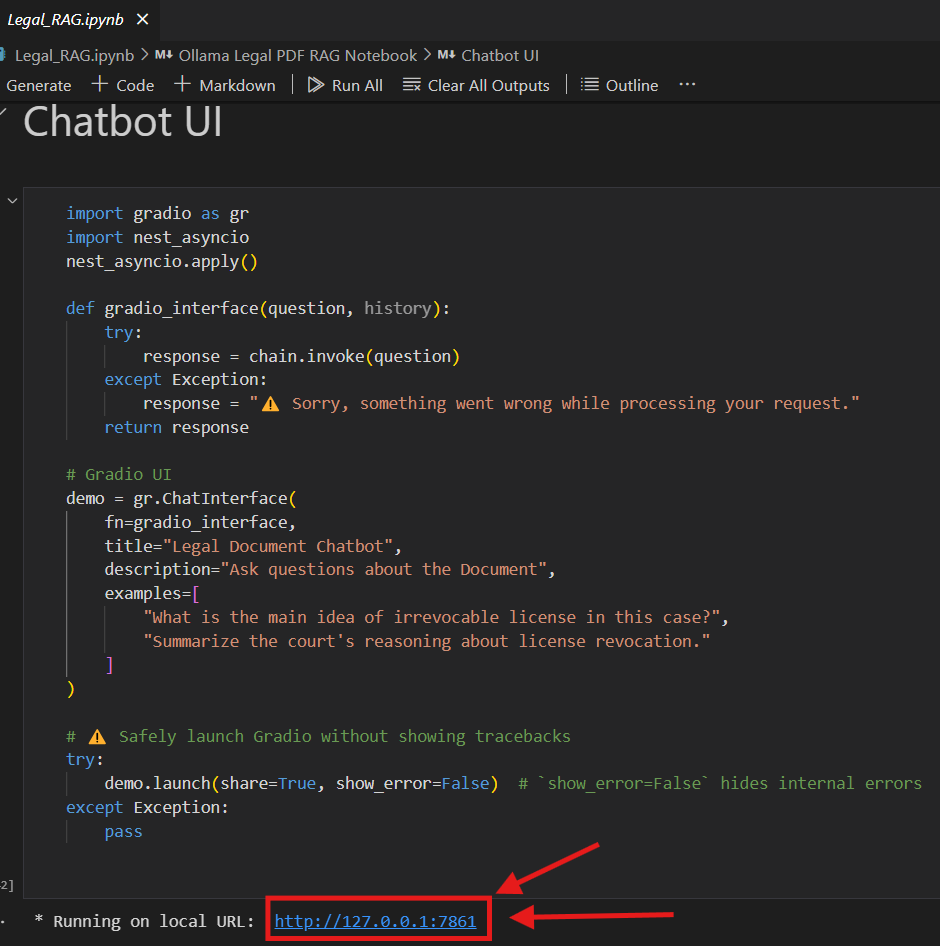

# RAG-based Legal Document Chatbot
## Overview
This repository contains a Retrieval-Augmented Generation (RAG) based chatbot designed to answer questions about legal documents. It leverages LangChain for orchestration, Ollama for embedding and LLM capabilities, and Chroma for vector storage. The chatbot is exposed via a Gradio interface for easy interaction.

## Features
- **Document Loading**: Load and process PDF files using `UnstructuredPDFLoader`.
- **Text Splitting**: Chunk documents into manageable pieces with `RecursiveCharacterTextSplitter`.
- **Embeddings**: Generate dense embeddings using `OllamaEmbeddings`.
- **Vector Store**: Store and retrieve chunks with Chroma vector database.
- **Multi-Query Retrieval**: Improve document lookup via `MultiQueryRetriever`.
- **QA Chain**: Custom prompt templates and parsers for high-quality responses.
- **Interactive UI**: Chat interface built with Gradio.

## Installation
1. **Clone this repository**
   ```bash
   git clone <your-repo-url>
   cd <your-repo-directory>
   ```
2. **Create a virtual environment**
   ```bash
   python3 -m venv venv
   source venv/bin/activate    # Linux/macOS
   venv\Scripts\activate     # Windows
   ```
3. **Install required packages**
   ```bash
   pip install -r requirements.txt
   ```

## Configuration
1. **Ollama Setup**: Ensure you have [Ollama](https://ollama.com/) installed and running locally.
2. **Choose a Model**: In `RAG.ipynb`, set the `local_model` variable to your preferred Ollama model (e.g., `gemma3:4b`).
3. **Load Your Document**: Place your PDF file in the project root and update the `local_path` variable in the notebook to point to it.

## Requirements
1. Below is a sample `requirements.txt`. Adjust versions as needed for compatibility:
```
langchain
langchain-community
langchain-ollama
langchain-text-splitters
chroma-db
gradio
nest_asyncio
unstructured
ipython
numpy<2
```

2. **Ollama Setup**: Ensure you have [Ollama](https://ollama.com/) installed and running locally.
3. **Install an Ollama Model**: Use the following command to pull a model (e.g., `nomic-embed-text` for embedding or `gemma:2b` for generation):


Make sure Ollama is installed and running. Then pull the required models:

```bash
# For generating text (LLM)
ollama pull gemma:2b

# For creating embeddings
ollama pull nomic-embed-text
```
1. Launch the Notebook:
   ```bash
   jupyter notebook RAG.ipynb
2. **Build the Vector Database**: Run all cells up to the vector store creation.
3. **Start the Chatbot**: Execute the final cells to launch the Gradio interface. You can then ask questions in the browser or share the auto-generated link.

## Chat via UI 
- Select the Link coming in UI cell 

## Example Queries
- "Can you explain the case study highlighted in the document?"
- "Summarize the arguments....."

